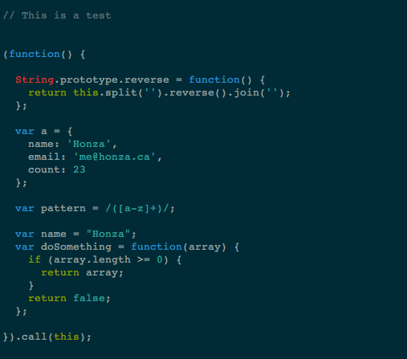

Solarized Pygments
==================

Present your code in style

Documentation & Source
----------------------

Source code is available on [Github][1]:

Examples
--------

* [Javascript](examples/javascript.html)
* [Python](examples/python.html)

License
-------

You are free to use this under the terms of the 
[BSD license][2].

Bugs & Issues
-------------

Please report all bugs on [Github][1].

Authors
-------

Solarized pygments was written and is maintained by [Honza Pokorny][3].

The awesome Solarized color palette is by [Ethan
Schoonover](http://ethanschoonover.com/)

[1]: https://github.com/honza/solarized-pygments
[2]: https://github.com/honza/solarized-pygments/blob/master/LICENSE
[3]: http://honza.ca
